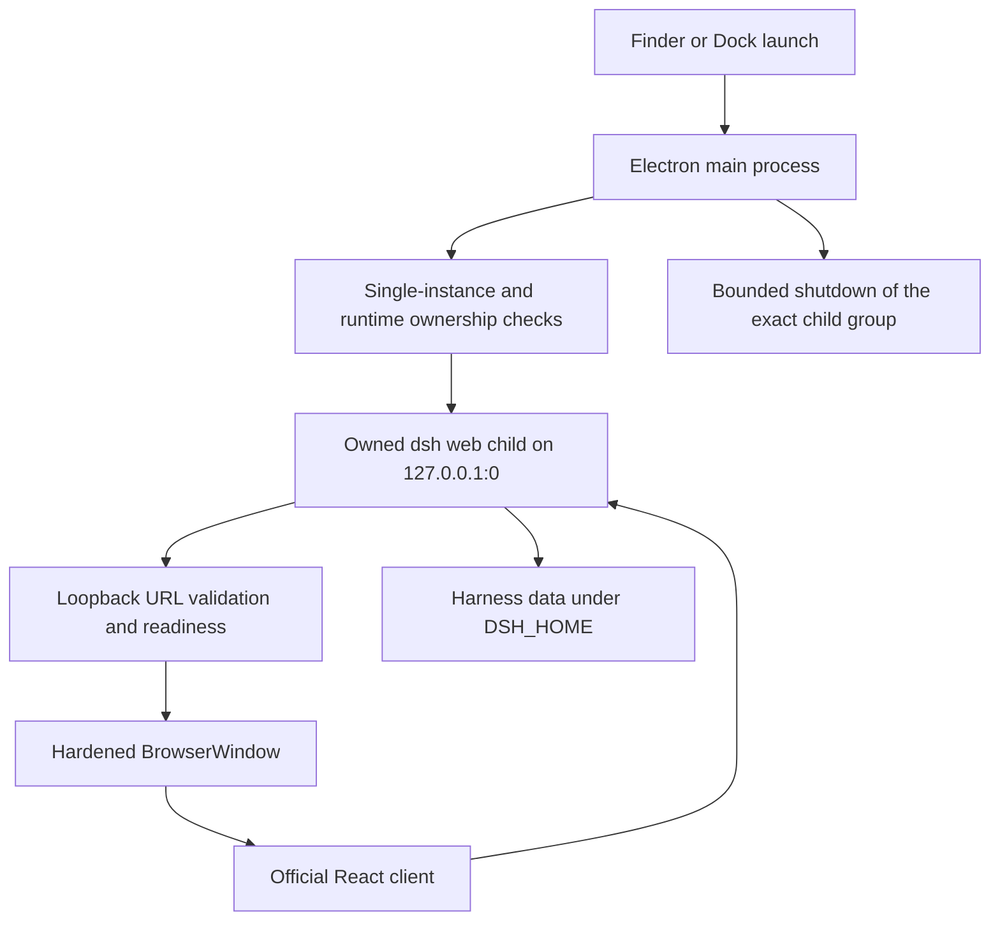

# DeepSeek Harness Desktop Design

English | [中文](2026-08-13-deepseek-harness-desktop-design.zh.md)

**Date:** 2026-08-13

**Status:** Implemented

**Target:** Intel macOS 15.7.4 (`x86_64`)

## Goal

Deliver the official DeepSeek Harness as a standalone Mac application. Launching it from Finder or the Dock opens one native window and manages an embedded Harness runtime without exposing a browser, terminal, or fixed port.

Version 1 preserves the official agent, session, plugin, model, WebSocket, and persistence systems. It changes the delivery shell and adds narrowly scoped desktop behavior instead of rewriting the product.

## User experience

- The product and Dock name are **DeepSeek Harness**.
- The white whale identity is presented inside the approved rounded blue and cream desktop tile.
- The workspace keeps the simple three-column Harness layout: sessions on the left, conversation in the center, and contextual details on the right.
- `Cmd+N`, `Cmd+K`, and `Cmd+,` invoke new session, command search, and settings.
- A second launch focuses the existing window.
- Window geometry is restored when it remains visible on a connected display.
- External HTTP(S) links open in the default browser; internal navigation stays in the application.
- Loading and failure surfaces appear inside the native window, never in a browser tab.

## Selected architecture

Electron is the smallest practical native shell for the existing React/Vite client. The main process starts the pinned official CLI as `dsh web --host 127.0.0.1 --port 0`, parses the assigned loopback URL, waits for readiness, and loads it in a hardened `BrowserWindow`.

The renderer keeps `nodeIntegration: false`, `contextIsolation: true`, `sandbox: true`, and `webSecurity: true`. A bundled CommonJS preload exposes only validated desktop commands and recovery actions; it does not expose raw Electron IPC, filesystem access, environment variables, or process APIs.

## Runtime and data ownership

The app uses the normal Harness `DSH_HOME`, which defaults to `~/.dsh`, so existing sessions, settings, credentials, presets, and plugins remain in place. Credential values are never copied, logged, bundled, or passed through the preload bridge.

Only one writer may use a data root. The application checks for an existing Harness before spawning and refuses takeover instead of killing an unrelated process. Automated and packaged tests always use a temporary `DSH_HOME`.

The child binds only to `127.0.0.1` on an operating-system-assigned port. Startup accepts only a valid loopback URL emitted by the exact owned child. Quit first requests graceful shutdown, then applies a bounded escalation only to the tracked process group and verifies that its listener is gone.

## Packaging

The Intel-only Electron application is packaged as an `.app` and DMG. Runtime packages are stored physically under `app.asar.unpacked/node_modules` because the Harness profile fallback creates filesystem symlinks to installed packages. The main entry remains in `app.asar`, and the preload is emitted as `preload.cjs` for Electron's sandboxed preload loader.

The local build is unsigned and unnotarized. Apple Developer signing, notarization, automatic updates, Apple Silicon, and Linux remain outside this Intel package. The separate [Windows Setup design](2026-08-14-deepseek-harness-windows-setup-design.md) owns Windows delivery.

## Failure handling

- A conflicting live Harness produces a closed diagnostic state before any child is spawned.
- Invalid URL, readiness timeout, or early child exit stops the owned child and shows Retry, Open Logs, and Quit.
- Renderer failure reuses the existing runtime rather than spawning a duplicate.
- Unexpected runtime exit replaces the Web surface with a disconnected failure surface.
- Lifecycle logs redact sensitive values and remain under Electron's application data directory.

## Acceptance criteria

- A Finder-launchable Intel `.app` and valid DMG are produced with the rounded desktop icon.
- No browser window or terminal is required.
- The listener uses a random loopback port rather than port 65000.
- The complete plugin graph remains stable after onboarding.
- The three-column workspace, settings dialog, and native shortcuts are present.
- Native Quit removes the Electron process, owned Harness descendants, and loopback listener.
- The pre-existing Hermes-owned Harness remains untouched until a separately confirmed migration.

## Verification boundary

Unit tests cover URL parsing, ownership, lifecycle, navigation, preload vocabulary, window state, staging, and packaged dependency resolution. The packaged smoke launches from outside the repository with temporary application data and `DSH_HOME`, verifies the preload and UI, waits for plugin stability, opens settings, quits through the native menu, and proves process and port cleanup. DMG verification checks the image checksum, x86_64 executable, bundle identifier, icon, and unpacked runtime packages.
