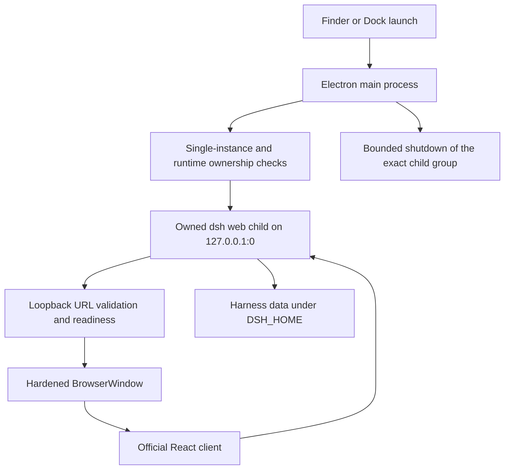

# DeepSeek Harness 桌面版设计

[English](2026-08-13-deepseek-harness-desktop-design.md) | 中文

**日期：** 2026-08-13

**状态：** 已实现

**目标平台：** Intel macOS 15.7.4（`x86_64`）

## 目标

将官方 DeepSeek Harness 交付为独立的 Mac 应用。从 Finder 或程序坞启动后，应用会打开一个原生窗口并管理内置的 Harness 运行时，不向用户暴露浏览器、终端或固定端口。

版本 1 保留官方的 agent、会话、插件、模型、WebSocket 与持久化系统。它只改变交付外壳并增加范围明确的桌面行为，不重写产品。

## 用户体验

- 产品名称和程序坞名称均为 **DeepSeek Harness**。
- 白鲸图形身份展示在已经确认的蓝色与奶白圆角桌面底板内。
- 工作区保留简洁的 Harness 三栏布局：左侧为会话，中间为对话，右侧为上下文详情。
- `Cmd+N`、`Cmd+K` 和 `Cmd+,` 分别调用新建会话、命令搜索和设置。
- 再次启动应用时聚焦已有窗口。
- 只在窗口仍位于已连接显示器的可见区域时恢复窗口尺寸和位置。
- 外部 HTTP(S) 链接在默认浏览器中打开；内部导航留在应用内。
- 加载与失败界面显示在原生窗口内，绝不打开浏览器标签页。

## 选定架构

对于现有 React/Vite 客户端，Electron 是改动最小且切实可行的原生外壳。主进程以 `dsh web --host 127.0.0.1 --port 0` 启动固定版本的官方 CLI，解析系统分配的回环地址，等待就绪后将其载入加固的 `BrowserWindow`。

渲染器保持 `nodeIntegration: false`、`contextIsolation: true`、`sandbox: true` 和 `webSecurity: true`。打包后的 CommonJS preload 只暴露经过校验的桌面命令与恢复动作；它不暴露原始 Electron IPC、文件系统访问、环境变量或进程 API。

## 运行时与数据所有权

应用使用 Harness 的标准 `DSH_HOME`，默认值为 `~/.dsh`，因此现有会话、设置、凭据、预设和插件均原地保留。凭据值绝不复制、记录到日志、打入软件包或经过 preload bridge 传递。

一个数据根目录只能有一个写入者。应用在 spawn 前检查已有 Harness；它会拒绝接管，而不会终止无关进程。自动化测试和成品测试始终使用临时 `DSH_HOME`。

子进程仅在操作系统分配的端口上监听 `127.0.0.1`。启动流程只接受准确受控子进程输出的有效回环地址。退出时先请求优雅关闭，然后仅对受跟踪的进程组执行有界升级，并确认监听端口已经消失。

## 打包

Intel 专用 Electron 应用同时打包为 `.app` 与 DMG。Harness profile fallback 需要创建指向已安装包的文件系统软链接，因此运行时包以实体文件形式存放在 `app.asar.unpacked/node_modules` 下。主入口保留在 `app.asar` 中，preload 则输出为 `preload.cjs`，供 Electron 的沙箱 preload loader 加载。

当前本机构建没有签名或公证。Apple Developer 签名、公证、自动更新、Apple Silicon 和 Linux 仍不属于这个 Intel 安装包的范围。Windows 交付由独立的 [Windows Setup 设计](2026-08-14-deepseek-harness-windows-setup-design.zh.md)负责。

## 失败处理

- 检测到冲突的在线 Harness 时，在 spawn 任何子进程之前进入封闭的诊断状态。
- 地址无效、就绪超时或子进程提前退出时，停止受控子进程并显示“重试”“打开日志”和“退出”。
- 渲染器失败时复用现有运行时，不 spawn 重复实例。
- 运行时意外退出时，用断开连接的失败界面替换 Web 界面。
- 生命周期日志会遮盖敏感值，并保存在 Electron 的应用数据目录下。

## 验收标准

- 使用圆角桌面图标生成可从 Finder 启动的 Intel `.app` 和有效 DMG。
- 无需浏览器窗口或终端。
- 监听端口使用随机回环端口，而不是 65000。
- 完成初始设置后，完整插件图持续稳定。
- 三栏工作区、设置对话框和原生快捷键均存在。
- 通过原生“退出”后，Electron 进程、受控 Harness 后代进程和回环监听端口均消失。
- 在另行确认迁移前，既有 Hermes 所拥有的 Harness 保持不变。

## 验证边界

单元测试覆盖地址解析、所有权、生命周期、导航、preload 词汇、窗口状态、暂存和成品依赖解析。成品 smoke 从仓库外启动，使用临时应用数据与 `DSH_HOME`，验证 preload 和界面，等待插件稳定，打开设置，通过原生菜单退出，并证明进程和端口均已清理。DMG 验证覆盖镜像校验和、x86_64 可执行文件、Bundle ID、图标以及已解包的运行时包。
