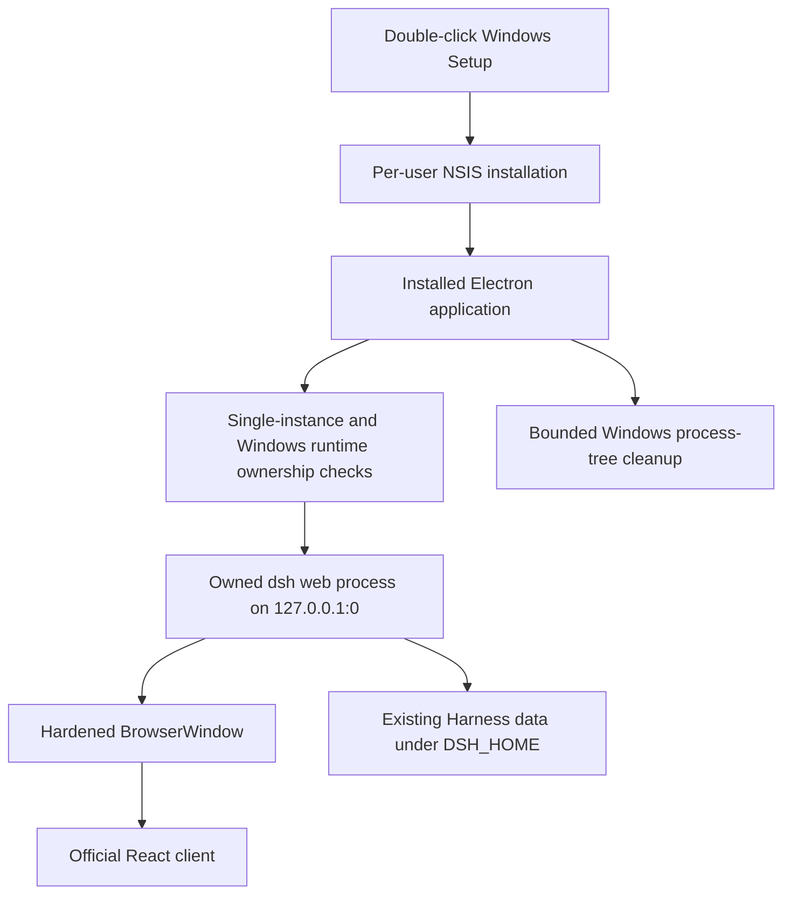

# DeepSeek Harness Windows Setup Design

English | [中文](2026-08-14-deepseek-harness-windows-setup-design.zh.md)

**Date:** 2026-08-14

**Status:** Implemented

**Target:** Windows 10 and Windows 11 (`x86_64`)

## Goal

Deliver the existing DeepSeek Harness desktop application as one Windows Setup executable. A user double-clicks `DeepSeek-Harness-Setup-<version>-win-x64.exe`; the per-user installer copies the complete application, creates Start menu and desktop shortcuts, launches DeepSeek Harness when installation finishes, and requires no separate Node.js, pnpm, terminal, browser, port, or administrator setup.

The Windows application reuses the Electron shell, React client, Harness runtime, data format, loopback transport, and rounded whale icon from the Intel macOS application. Platform-specific code is limited to native window behavior, menus, process discovery, process-tree termination, packaging, and verification.

## Installation experience

- The NSIS installer runs in one-click per-user mode under `%LOCALAPPDATA%`; it does not request an installation directory or require elevation.
- Setup creates Start menu and desktop shortcuts named **DeepSeek Harness** and launches the installed application after a successful install.
- Installing a newer build replaces the installed application without migrating or deleting Harness data.
- Uninstall removes the application and its shortcuts but preserves the user's Harness home and Electron user data.
- Version 1 is unsigned. Windows SmartScreen may require the user to confirm the publisher warning; avoiding that operating-system prompt requires a trusted Windows code-signing certificate.

## Runtime architecture

The application keeps `nodeIntegration: false`, `contextIsolation: true`, `sandbox: true`, and `webSecurity: true`. It accepts only the validated loopback URL emitted by its exact child process and never exposes credentials or raw Electron APIs to the renderer.

## Windows process and data ownership

Windows process discovery uses the built-in Windows PowerShell process provider without loading user profiles. Failure to inspect running processes fails closed before the application starts another writer. A detectable `dsh web` process is treated as a conflict on Windows because the operating system does not provide a built-in non-elevated equivalent of the macOS open-file inspection used to prove a different `DSH_HOME`.

The desktop child is tracked by its exact positive PID. Windows shutdown terminates that PID and its descendants with the operating system's process-tree command, awaits the child exit, and keeps cleanup idempotent when the process has already disappeared. macOS keeps its existing process-group signal behavior.

Automated tests and packaged smoke checks use a temporary `DSH_HOME` and temporary Electron user-data directory. They never read, copy, modify, or delete the real Windows Harness data.

## Native Windows behavior

- The main window uses the standard Windows frame and title bar; macOS traffic-light configuration is not passed on Windows.
- `Ctrl+N`, `Ctrl+K`, and `Ctrl+,` open a new session, command search, and settings.
- The Windows menu follows File, Edit, View, Window, and Help conventions.
- Closing the last Windows window quits the application and waits for the owned Harness process tree to stop. macOS retains close-to-Dock behavior.
- External HTTP(S) links open in the default browser; internal loopback navigation remains inside the application.

## Packaging

Electron Builder produces one x64 NSIS Setup executable with the rounded desktop master converted to a Windows icon. Native Windows dependency installation and Electron rebuilding select the Windows x64 runtime modules; the packaging allowlist removes the unused platform variants carried by the staged dependency.

The source build runs on macOS for platform-independent checks, but only a native Windows x64 build is accepted as release evidence. The existing `windows-native` CI job builds the Setup, runs its installed lifecycle, writes a SHA-256 file, and uploads the executable and checksum as one artifact.

## Failure handling

- Process-inspection failure, a conflicting Harness, an invalid startup URL, readiness timeout, or early child exit shows the existing closed failure page without opening a second writer.
- Setup and uninstall failures return a non-zero result to the native smoke script, which performs a bounded fallback uninstall when an installed uninstaller exists.
- Runtime or renderer exit continues to use the existing in-window recovery actions.
- Lifecycle logs redact sensitive values and remain inside Electron's application-data directory.

## Acceptance criteria

- `DeepSeek-Harness-Setup-<version>-win-x64.exe` installs without Node.js, pnpm, a terminal, a browser, a fixed port, or administrator privileges.
- Installation creates working Start menu and desktop shortcuts and launches the installed application.
- The application restores the Harness workspace, displays the three-column desktop UI, and opens settings through the native command.
- The listener uses a random `127.0.0.1` port.
- Native Quit and window close remove the Electron process, owned Harness descendants, and loopback listener.
- Silent install and uninstall checks prove that application files and shortcuts are removed while temporary Harness data remains.
- The Setup executable checksum and native Windows smoke results are reported separately from macOS-only unit and cross-build evidence.

## Verification boundary

Unit tests cover Windows window and menu selection, ownership discovery, process-tree termination, NSIS configuration, workflow wiring, and PowerShell process-output parsing. Production staging validates the bundled entrypoints, rounded icon containers, runtime CLI, Web frontend, and native-module presence.

The native Windows smoke installs the unsigned Setup into an isolated directory, verifies desktop and Start menu shortcuts, launches the installed executable with temporary Harness and Electron data, exercises the three-column UI and settings, closes the native window, proves that the owned process tree and listener disappear, uninstalls the application, and verifies that both data markers remain. Silent installation launches the executable explicitly; `runAfterFinish` governs the interactive one-click finish path.

macOS cannot rebuild Windows native modules through `node-gyp`; that expected cross-build failure is not a Windows product failure and never substitutes for the native job result.
