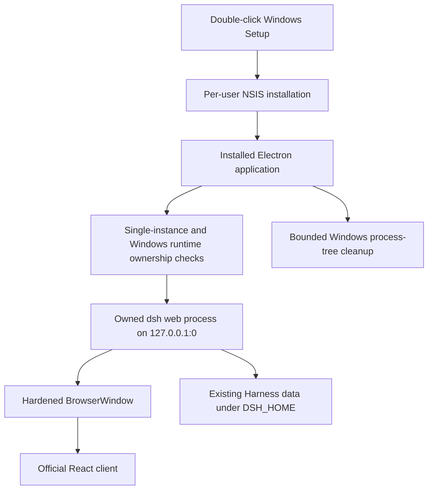

# DeepSeek Harness Windows 一键安装设计

[English](2026-08-14-deepseek-harness-windows-setup-design.md) | 中文

**日期：** 2026-08-14

**状态：** 已批准

**目标平台：** Windows 10 和 Windows 11（`x86_64`）

## 目标

把现有 DeepSeek Harness 桌面应用交付成一个 Windows Setup 程序。用户双击 `DeepSeek-Harness-Setup-<version>-win-x64.exe` 后，安装器在当前用户目录完成应用复制，创建开始菜单和桌面快捷方式，并在安装成功后启动 DeepSeek Harness；用户不需要另行安装 Node.js、pnpm，不需要使用终端、浏览器、端口或管理员配置。

Windows 应用复用 Intel macOS 版本的 Electron 外壳、React 客户端、Harness 运行时、数据格式、回环通信和用户提供的白鲸图标。平台专属代码只负责原生窗口行为、菜单、进程发现、进程树退出、打包和验证。

## 安装体验

- NSIS 使用当前用户的一键安装模式，安装到 `%LOCALAPPDATA%`，不询问安装目录，也不需要管理员权限。
- Setup 创建名为 **DeepSeek Harness** 的开始菜单和桌面快捷方式，并在成功安装后启动应用。
- 安装新版本时替换程序文件，不迁移或删除 Harness 数据。
- 卸载时删除应用和快捷方式，保留用户的 Harness 主目录和 Electron 用户数据。
- 第一版不签名。Windows SmartScreen 可能要求用户确认发布者警告；只有受信任的 Windows 代码签名证书才能消除该系统提示。

## 运行架构

应用继续启用 `nodeIntegration: false`、`contextIsolation: true`、`sandbox: true` 和 `webSecurity: true`。它只接受自身子进程输出并通过验证的回环地址，不向渲染进程暴露凭据或原始 Electron API。

## Windows 进程与数据所有权

Windows 进程发现通过不加载用户配置的内置 Windows PowerShell 进程提供程序完成。无法检查运行进程时，应用在启动另一个数据写入者之前关闭失败。Windows 没有与 macOS 打开文件检查等价的内置、非提权接口，因此任何能够识别的 `dsh web` 进程都按冲突处理，不能假定它使用了不同的 `DSH_HOME`。

桌面应用只跟踪自身子进程的准确正数 PID。Windows 退出通过系统进程树命令终止该 PID 及其后代，并等待子进程退出；进程已经消失时，清理保持幂等。macOS 继续使用现有进程组信号行为。

自动测试和打包后冒烟测试使用临时 `DSH_HOME` 与临时 Electron 用户数据目录，不读取、复制、修改或删除真实 Windows Harness 数据。

## Windows 原生行为

- 主窗口使用标准 Windows 窗框和标题栏；macOS 交通灯配置不会传给 Windows。
- `Ctrl+N`、`Ctrl+K` 和 `Ctrl+,` 分别打开新会话、命令搜索和设置。
- Windows 菜单采用 File、Edit、View、Window 和 Help 结构。
- 关闭最后一个 Windows 窗口会退出应用，并等待应用拥有的 Harness 进程树停止；macOS 保留关闭到 Dock 的行为。
- 外部 HTTP(S) 链接在默认浏览器中打开，内部回环导航留在应用内。

## 打包

Electron Builder 使用用户提供的白鲸图转换 Windows 图标，并生成一个 x64 NSIS Setup 程序。暂存运行时包含 Windows x64 原生模块，并从 Windows 产物排除 macOS、Linux、ARM64 和 IA-32 原生二进制文件。

源码可以在 macOS 上执行平台无关检查，但 Windows 发布只接受原生 `windows-latest` 构建。工作流把 Setup 程序及其 SHA-256 校验和作为构建产物上传。

## 失败处理

- 进程检查失败、Harness 冲突、启动地址无效、就绪超时或子进程提前退出时，应用显示现有封闭错误页，不会启动第二个数据写入者。
- Setup 失败时不留下正在运行的应用进程，并通过 NSIS 结果报告失败。
- 运行时或渲染进程退出时继续使用现有窗口内恢复操作。
- 生命周期日志脱敏后保存在 Electron 应用数据目录内。

## 验收标准

- `DeepSeek-Harness-Setup-<version>-win-x64.exe` 无需 Node.js、pnpm、终端、浏览器、固定端口或管理员权限即可安装。
- 安装后开始菜单和桌面快捷方式有效，并自动启动应用。
- 应用恢复 Harness 工作区，显示三栏桌面界面，并能通过原生命令打开设置。
- 监听地址使用随机 `127.0.0.1` 端口。
- 原生退出和关闭窗口都会清除 Electron 进程、应用拥有的 Harness 后代进程与回环监听端口。
- 静默安装与卸载检查证明应用文件和快捷方式已删除，同时临时 Harness 数据仍然保留。
- Setup 校验和与原生 Windows 冒烟结果独立于仅在 macOS 上完成的单元测试和交叉构建证据报告。
