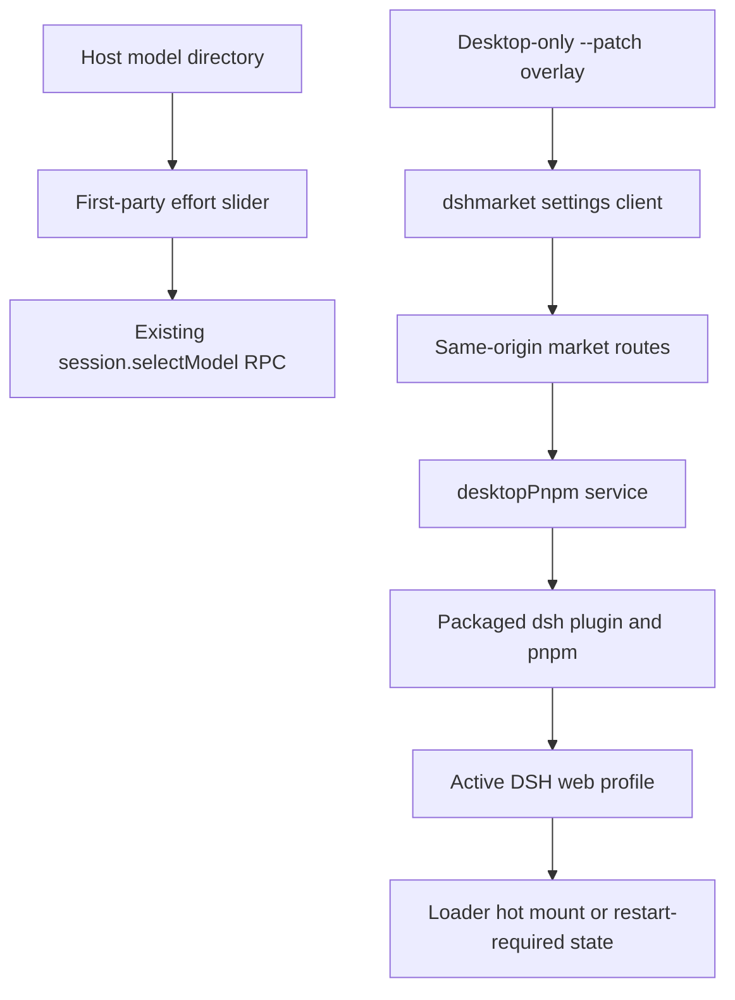

# DeepSeek Harness Effort Slider and Plugin Marketplace Design

English | [中文](2026-08-17-deepseek-harness-effort-slider-plugin-market-design.zh.md)

**Date:** 2026-08-17

**Status:** Approved; implementation in progress

**Target:** DeepSeek Harness Desktop on Intel macOS and Windows x64

## Goal

DeepSeek Harness Desktop will provide a polished particle-backed reasoning-effort slider beside the existing composer model control and the audited `dshmarket@1.10.1` marketplace under Settings. The slider submits only effort identifiers advertised by the selected model. The marketplace installs, updates, enables, disables, and removes curated plugins without requiring Node.js, pnpm, a terminal, an external browser, administrator rights, or a fixed port.

The slider combines the visual direction of [dsh-effort-slider](https://github.com/2768651338/dsh-effort-slider) with the model-metadata discipline of [dsh-reasoning-effort](https://github.com/HanaAyane/dsh-reasoning-effort). It does not load either third-party Host provider. The marketplace reuses the mature [dsh-market](https://github.com/dsh-market/dsh-market) implementation instead of duplicating its catalog, rollback, diagnostics, and hot-mount logic.

## Product Decisions

- The effort slider is first-party UI inside the existing `ui-model-selection` package.
- The Host remains the only source of provider, model, effort identifier, order, name, description, and default effort.
- `max` may be presented as `ULTRACODE`; the submitted value remains the exact advertised identifier.
- Official DeepSeek currently advertises `off`, `high`, and `max`; the UI never invents `low` or `medium`.
- Desktop pins and redistributes `dshmarket@1.10.1`. Its curated registry and bundled snapshot supply the marketplace catalog.
- GitHub Topics are discovery inputs, not an installation API. Desktop exposes no free-form package, command, filesystem, registry, or executable field.
- Desktop supplies immutable profile identity and packaged package-manager access through `desktopProfiles` and `desktopPnpm`; the market never provisions system pnpm in Desktop mode.
- pnpm's deny-by-default build policy remains authoritative. A blocked build requires an explicit per-package approval and retry.

## Architecture

The effort component receives the selected model's advertised efforts and a commit callback. It has no Cordis, provider, filesystem, Electron, or network authority. Model selection continues through the existing directory service and Host validation.

The marketplace is mounted by a Desktop-only patch passed to the bundled CLI before Web arguments. The patch first mounts a small first-party Host adapter that publishes the active web profile and a generation-scoped package-operation service, then mounts pinned `dshmarket`. Ordinary Web launches do not receive the patch. Electron preload gains no marketplace, filesystem, shell, package, or raw IPC method.

## Effort Slider

The current model's `reasoning.efforts` array defines the stops in order. The selected value is the current session effort or model default. Pointer, click, Arrow keys, Home, and End commit exactly one advertised identifier through the existing `ModelDirectory.select()` path. Busy state prevents duplicate commits; rejection keeps the previous selection and uses the existing error path.

The control stays in the current model menu's Effort panel and expands that native surface only while the effort pane is open. A Claude Code-inspired wide energy landscape uses DeepSeek blue/cyan, Faster/Smarter direction labels, a thin track, and a luminous selected stop; its low-frequency WebGL cloud and sparse particles never cover the labels. `prefers-reduced-motion: reduce` disables continuous animation, and a static CSS gradient remains when WebGL or animation is unavailable. Unknown future identifiers remain selectable and use Host-provided labels.

## Plugin Marketplace

Pinned `dshmarket` contributes its searchable catalog, installed view, themes, progress, diagnostics, backup, and package actions to Settings. Existing first-party Configuration and read-only Plugin list tabs remain unchanged.

Market mutations require same-origin loopback requests. `dshmarket` validates catalog membership and command targets, holds one operation lock, snapshots manifest dependencies for failed-operation rollback, validates loadable DSH artifacts and duplicate Loader ids, and hot-mounts supported plugins. Its Desktop adapter calls `desktopPnpm.runPlugin()`, which invokes the packaged DSH CLI so upstream profile initialization, relative-source anchoring, and `dsh.profile.bundles` reconciliation remain authoritative.

`desktopPnpm` resolves the packaged pnpm entry itself, rejects empty or NUL-bearing arguments and non-absolute caller directories, scrubs credential-shaped environment variables, owns bounded output streams, serializes operations, and delegates cancellation and whole-tree teardown to the existing subprocess service. Detached self-restart is disabled in Desktop mode. Hot-mountable plugins activate immediately; other changes remain visibly restart-required until the application is relaunched normally.

## Security and Failure Handling

- The Desktop patch is an application resource, not a user-writable profile overlay.
- `desktopProfiles.current` is immutable for one Cordis generation. After Desktop is detected, the market never falls back to an ambient or guessed profile.
- Browser code cannot submit arbitrary package targets. Market routes re-resolve curated entries before mutation.
- The packaged pnpm entry and CLI entry are resolved by trusted Host code, not renderer input.
- Package children receive a credential-scrubbed environment and only the explicit active `DSH_HOME` fact needed by the CLI.
- Packages without loadable DSH artifacts, or with Loader ids that collide with the active profile, are removed before they can break the next boot.
- A missing Desktop service leaves the market adapter pending instead of mutating through system pnpm.
- WebGL failure affects presentation only. Package failure, timeout, cancellation, or partial manifest write is reported through the market's bounded result and rollback safeguards.
- Sessions, credentials, workspaces, and Electron user data are never copied, deleted, or included in package-operation output.

## Verification and Acceptance

- Component tests cover advertised stops, `ULTRACODE`, pointer and keyboard commits, busy state, reduced motion, and canvas fallback.
- Model-selection tests prove every committed effort belongs to the selected model's advertised array and that official DeepSeek never emits invented `low` or `medium` values.
- Adapter tests cover immutable profile identity, packaged pnpm resolution, argument and path rejection, single-operation locking, `dsh plugin` invocation, cancellation, whole-tree teardown, and credential scrubbing.
- Integration tests prove only Desktop mounts pinned `dshmarket`, ordinary Web omits it, and the market consumes Desktop services instead of system pnpm provisioning.
- A real Web composition opens the slider and Marketplace through the assembled application without external credentials.
- Packaged macOS and Windows acceptance install and remove a prebuilt fixture under temporary `DSH_HOME`, verify Loader state and data sentinels, and exercise the slider.

Acceptance requires a single polished effort control in the existing composer area, exact advertised effort values, a searchable market with install/update/enable/disable/remove actions, no external runtime prerequisite, no new preload authority, preserved Harness data, and green macOS Intel plus native Windows packaged checks before release publication.

## Alternatives and Scope

Installing both effort plugins was rejected because they compete for the same composer seat and one changes provider capability metadata. Rebuilding a second market was rejected after auditing `dshmarket@1.10.1`; duplication would increase risk and maintenance cost. Installing arbitrary GitHub repositories was rejected because a Topic does not establish compatibility, authorship, immutability, or safe lifecycle behavior.

Arbitrary package specifications, automatic installation from GitHub Topics, administrator-level plugins, writes outside the active web profile, code signing, notarization, marketplace publisher accounts, and automatic release publication are out of scope.
