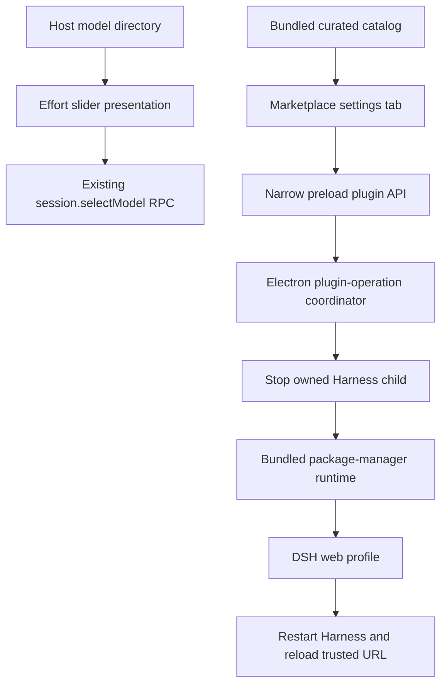

# DeepSeek Harness Effort Slider and Plugin Marketplace Design

English | [中文](2026-08-17-deepseek-harness-effort-slider-plugin-market-design.zh.md)

**Date:** 2026-08-17

**Status:** Awaiting written review

**Target:** DeepSeek Harness Desktop on Intel macOS and Windows x64

## Goal

DeepSeek Harness Desktop will provide a polished particle-backed reasoning-effort slider beside the composer model control and a curated plugin marketplace under Settings. The slider must submit only effort identifiers advertised by the selected model. The marketplace must install, disable, enable, and remove reviewed plugins without requiring Node.js, pnpm, a terminal, or a browser from the user.

The design combines the visual direction of [dsh-effort-slider](https://github.com/2768651338/dsh-effort-slider) with the model-metadata discipline of [dsh-reasoning-effort](https://github.com/HanaAyane/dsh-reasoning-effort). It does not load both plugins into the same composer seat and does not copy either plugin's Host-side provider provisioning.

## Product Decisions

- The effort slider is a built-in Web Client plugin and is available immediately after the desktop update.
- The Host remains the only source of provider, model, effort identifier, order, name, description, and default-effort data.
- `max` may be presented as `ULTRACODE`; the submitted value remains the exact advertised identifier.
- A model that advertises `off`, `high`, and `max` receives three selectable stops. The UI never invents `low` or `medium` for that model.
- The plugin marketplace is curated. GitHub Topics and arbitrary repository URLs are discovery inputs for maintainers, not executable install sources for the application.
- Marketplace operations are desktop-only. The ordinary browser application retains the read-only installed-plugin inventory and does not receive package-management authority.
- Version one installs exact reviewed versions with lifecycle scripts disabled. Plugins that require install scripts are ineligible until a narrower reviewed mechanism exists.

## Architecture

The effort work stays inside the existing `ui-model-selection` package because that package owns the shared per-session model directory and the composer model seat. A focused `EffortSlider` presentation component receives the current model's effort rows and a selection callback; it does not access Cordis, Electron, provider configuration, or the session RPC directly.

The marketplace adds a dedicated Web Client settings plugin and a desktop-main coordinator. The client contributes one `settings.plugins.tab` entry and receives plain catalog state and actions from its registration-side bridge. Electron preload exposes only typed marketplace operations. Electron main validates every sender against the trusted main window, main frame, and current loopback origin before it accepts an operation.

## Effort Slider

### Data and Selection

The current model's `reasoning.efforts` array defines the slider stops in order. The selected value is the current session effort or the model default. Each interaction calls the existing `ModelDirectory.select()` path with the current provider, model, and exact selected effort. The Host performs its existing route and effort validation before it persists the selection.

The visible label uses the adapter-provided name except for the presentation alias `max` to `ULTRACODE`. Accessibility text retains both meanings, such as `ULTRACODE, maximum reasoning`. Unknown identifiers remain selectable and display their adapter-provided name; the client does not collapse them into a hard-coded five-level vocabulary.

### Interaction and Rendering

- The root model menu keeps its existing Model and Effort rows. Opening Effort displays the slider panel in the same anchored dropdown.
- Pointer dragging previews the nearest stop; pointer release, click, keyboard arrows, Home, and End commit one advertised stop.
- Busy selection locks commits while preserving the current value. A rejected selection keeps the previous stop and uses the existing composer toast.
- The WebGL canvas renders a restrained blue-violet particle stream whose energy follows the selected stop. It has no network, storage, model, or package access.
- WebGL initialization failure uses a CSS gradient track. `prefers-reduced-motion: reduce` keeps the static track and thumb but disables continuous animation.
- The control follows the existing semantic theme tokens, keyboard focus style, dark and light themes, compact width, and responsive overflow rules.

If shader or particle code is adapted from the BSD-3-Clause `dsh-effort-slider` repository, the exact reused portion, upstream revision, copyright notice, and license are recorded in `THIRD_PARTY_NOTICES.md`. Host provisioning, provider dialect mapping, and model-metadata injection are excluded.

## Plugin Marketplace

### Settings Experience

The existing Plugins section contains three tabs:

1. **Marketplace** — searchable reviewed cards with name, summary, publisher, exact version, license, compatibility, declared capabilities, and install state.
2. **Installed** — the current Loader inventory joined with package-management state, with enable, disable, remove, and restart-required status.
3. **Configuration** — the existing Host plugin configuration cards without behavioral changes.

Built-in plugins are labeled `Built in` and cannot be removed. Third-party entries expose one primary action at a time. An install or removal shows one global operation state so concurrent package writes cannot start.

### Catalog

Version one ships a catalog snapshot inside the application artifact. Each entry contains a stable catalog id, npm package name, display metadata, exact version, DSH version range, supported desktop platforms, license identifier, source repository, declared capabilities, package integrity, and reviewed publication status.

The application does not scrape `github.com/topics/dsh-plugin` at runtime. Adding or updating a catalog entry is a source-reviewed desktop release change. This makes the catalog useful immediately while keeping publisher trust, package version, and integrity reviewable with the application code. Remote catalog refresh and arbitrary-source developer mode are outside version one.

### Installation Lifecycle

The desktop package includes the package-manager runtime used for profile operations. The renderer sends only a catalog id and requested action; it cannot send a package specifier, command-line argument, filesystem path, registry URL, or executable name.

For an install, update, enable, disable, or removal, Electron main performs this sequence:

1. Acquire a process-local operation lock and re-resolve the selected bundled catalog entry.
2. Copy the web profile control files to an operation-specific backup under the Electron application-data directory without copying credentials or session data.
3. Stop the exact Harness child process owned by the desktop application and wait for its process tree to exit.
4. Invoke the bundled package manager through Electron's Node mode with a fixed argument template, exact package version, fixed web profile directory, and lifecycle scripts disabled.
5. Reconcile `dsh.profile.bundles`, validate the resulting manifest, resolve every enabled bundle, and run a bounded `dsh --profile web --dump-config` preflight.
6. On success, remove the backup, restart Harness on a new random loopback port, and load only its validated URL.
7. On failure, restore the profile control files, run a recovery install from the restored lockfile when required, restart the previous profile, and report a sanitized error.

The coordinator never edits `~/.dsh` while its owned Harness child is running. It does not inspect, copy, log, or remove credentials, workspaces, sessions, or Electron user data. Residual unreferenced package-store files after a rollback are not executable because the restored manifest and bundle list do not reference them; later maintenance may prune them explicitly.

## Desktop Security

- Preload exposes structured marketplace methods only under context isolation; it does not expose IPC primitives, shell execution, filesystem access, or arbitrary URLs.
- Electron main accepts requests only from the trusted main `webContents`, its main frame, and the exact current `http://127.0.0.1:<random-port>` origin.
- Catalog and action values are validated again in Electron main. Renderer-provided display data is never trusted.
- Package installation uses exact versions, verifies the expected package integrity, disables lifecycle scripts, and rejects packages whose installed manifest lacks a DSH bundle patch.
- Output is byte-bounded and sanitized before reaching logs or UI. Environment values, credentials, profile documents, and package-manager command lines are not included in user-visible errors.
- Symlink and path checks keep backup, profile, and package operations inside their exact resolved roots. Deletion targets are explicit and validated.

## Failure Handling

- A missing desktop bridge hides Marketplace mutation controls and leaves the installed-plugin inventory readable.
- WebGL or animation failures affect only presentation and never disable model selection.
- Catalog validation failure disables marketplace actions and identifies the invalid catalog entry without starting an install.
- Package-manager failure, incompatible DSH version, bundle-resolution failure, config-preflight failure, Harness restart failure, or operation timeout enters rollback before the UI reports failure.
- If both the requested profile and restored profile fail to start, the existing desktop failure page reports the bounded diagnostic and preserves both the backup and Harness data for recovery.
- Closing the application during an operation requests cancellation, waits for the bounded coordinator settlement, and then applies the existing forced process-tree cleanup if necessary.

## Persistence and Compatibility

The effort selection continues through existing session model-selection events and settings. The visual component adds no new durable format. Marketplace state derives from the web profile manifest, bundle list, Loader inventory, and bundled catalog; it does not maintain a second installed-plugin database.

Desktop package versioning will advance because the application gains a bundled package-management dependency and new native lifecycle behavior. Existing `~/.dsh` profiles remain valid. A marketplace action changes only the selected profile's dependency and bundle configuration through the same manifest format used by `dsh plugin`.

## Verification

- Component tests cover advertised-stop rendering, `max` presentation, pointer and keyboard selection, rejected selection rollback, busy state, reduced motion, and the WebGL fallback.
- Model-selection tests prove every submitted effort belongs to the selected model's advertised array and that DeepSeek's three-stop catalog never produces `low` or `medium`.
- Catalog tests cover schema rejection, duplicate ids, incompatible DSH ranges, unsupported platforms, invalid integrity values, unreviewed entries, and deterministic installed-state joining.
- Desktop tests cover trusted-sender checks, operation locking, fixed package-manager arguments, bounded output, explicit roots, backup and restore, lifecycle-script denial, preflight failure, restart settlement, and sanitized errors.
- A real-composition Web test opens the effort control and Marketplace tab through the assembled application without external credentials.
- Packaged macOS acceptance installs and removes a fixture plugin under a temporary `DSH_HOME`, verifies restart on a new random port, confirms the fixture Loader entry, exercises the slider, and proves the temporary session and credential sentinels are unchanged.
- Native Windows CI performs the same install, restart, inventory, removal, process-tree, shortcut, uninstall, and data-preservation checks against the real Setup artifact.

## Acceptance Criteria

- The composer shows a polished particle effort slider in the existing model-control region without duplicate selectors.
- Only exact model-advertised effort identifiers can be committed; official DeepSeek exposes `off`, `high`, and `max`.
- `max` is shown as `ULTRACODE` without changing its wire value.
- Settings provides searchable Marketplace, Installed, and Configuration views with keyboard and screen-reader support.
- A desktop user can install, enable, disable, and remove a reviewed plugin with buttons and automatic Harness restart, without Node.js, pnpm, terminal, browser, administrator rights, or a fixed port.
- Failed operations restore the previous runnable profile and preserve Harness sessions, workspaces, credentials, and Electron user data.
- Ordinary browser clients cannot request package installation or access the desktop bridge.
- macOS Intel and native Windows packaged acceptance pass before release assets are published.

## Alternatives Rejected

Installing both third-party effort plugins was rejected because both compete for the same composer control and one changes provider capability metadata. Installing arbitrary repositories from the GitHub Topic was rejected because the Topic does not establish compatibility, authorship, package immutability, or safe lifecycle scripts. Shipping every candidate plugin inside the application was rejected because it increases artifact size and does not provide independent installation or removal.

## Out of Scope

- Arbitrary GitHub URL, filesystem path, git branch, or package-specifier installation.
- Automatic discovery from GitHub Topics or `awesome-dsh-plugin` without review.
- Remote catalog refresh independent of a desktop release.
- Plugins that require lifecycle scripts, native compilation, administrator rights, or writes outside the DSH web profile.
- Automatic publication, code signing, notarization, or marketplace publisher accounts.
