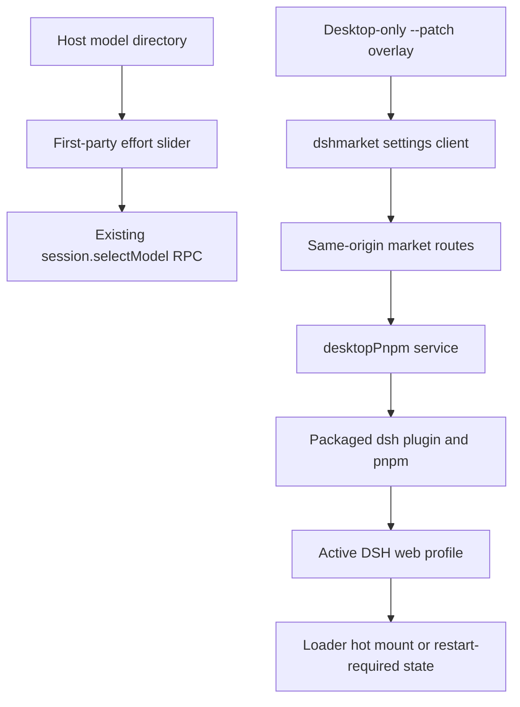

# DeepSeek Harness 思考等级滑块与插件市场设计

[English](2026-08-17-deepseek-harness-effort-slider-plugin-market-design.md) | 中文

**日期：** 2026-08-17

**状态：** 已确认；正在实现

**目标平台：** Intel macOS 与 Windows x64 上的 DeepSeek Harness Desktop

## 目标

DeepSeek Harness Desktop 将在现有输入区模型控件旁提供精致的粒子思考等级滑块，并在设置中接入经审计的 `dshmarket@1.10.1`。滑块只提交当前模型声明支持的思考等级标识。插件市场让用户无需安装 Node.js、pnpm，无需终端、外部浏览器、管理员权限或固定端口，即可安装、更新、启用、停用和删除经过整理的插件。

滑块结合 [dsh-effort-slider](https://github.com/2768651338/dsh-effort-slider) 的视觉方向与 [dsh-reasoning-effort](https://github.com/HanaAyane/dsh-reasoning-effort) 的模型元数据约束，但不会加载任一第三方 Host provider。插件市场复用成熟的 [dsh-market](https://github.com/dsh-market/dsh-market)，不重复实现其目录、回滚、诊断和热挂载逻辑。

## 产品决策

- 思考等级滑块作为第一方 UI，放在现有 `ui-model-selection` 包内。
- provider、模型、思考等级标识、顺序、名称、说明与默认值只以 Host 为准。
- `max` 可显示为 `ULTRACODE`，实际提交值仍是原始标识。
- 官方 DeepSeek 当前只声明 `off`、`high` 和 `max`；界面不会虚构 `low` 或 `medium`。
- Desktop 锁定并重新分发 `dshmarket@1.10.1`；其精选 registry 与内置快照共同提供市场目录。
- GitHub Topics 只用于发现，不是安装接口。Desktop 不暴露自由输入的包名、命令、文件路径、registry 或可执行文件字段。
- Desktop 通过 `desktopProfiles` 与 `desktopPnpm` 提供不可变 profile 身份和内置包管理能力；Desktop 模式下市场不会安装系统 pnpm。
- pnpm 默认拒绝构建脚本的策略仍然有效；被拦截的构建必须由用户按包明确批准后重试。

## 架构

思考组件只接收当前模型声明的等级与提交回调，不拥有 Cordis、provider、文件系统、Electron 或网络权限。模型选择继续走现有目录服务与 Host 校验。

插件市场由传给内置 CLI 的 Desktop 专用 patch 挂载，并且位于 Web 参数之前。patch 先挂载一个很小的第一方 Host 适配器，发布当前 web profile 与按 generation 管理的包操作服务，再挂载锁定版本的 `dshmarket`。普通 Web 启动不会收到这个 patch。Electron preload 不新增市场、文件系统、shell、包管理或原始 IPC 方法。

## 思考等级滑块

当前模型的 `reasoning.efforts` 数组按顺序定义所有停靠点。选中值来自当前会话等级或模型默认等级。拖动、点击、方向键、Home 与 End 只会通过现有 `ModelDirectory.select()` 路径提交一个模型已声明的标识。忙碌状态阻止重复提交；提交失败则保留旧值，并走现有错误提示路径。

控件仍位于当前模型菜单的 Effort 面板，仅在打开思考等级时扩宽这块原生表面。Claude Code 风格的宽幅能量景观采用 DeepSeek 蓝与青色，包含“更快 / 更智能”方向提示、细轨道和发光选中档位；低频 WebGL 能量云与稀疏粒子不会遮住文字。`prefers-reduced-motion: reduce` 会关闭持续动画；WebGL 或动画不可用时保留静态 CSS 渐变，不影响选择。未来出现的未知标识仍可选择，并使用 Host 提供的文字。

## 插件市场

锁定版本的 `dshmarket` 会把已有的搜索目录、已安装列表、主题、进度、诊断、备份和包操作界面接入设置。现有第一方 Configuration 与只读 Plugin list 标签保持不变。

市场写操作要求同源回环请求。`dshmarket` 会校验目录成员与命令目标，只允许一个操作并发，针对失败操作保存 manifest dependency 快照，检查可加载的 DSH 产物和重复 Loader id，并热挂载兼容插件。其 Desktop 适配器调用 `desktopPnpm.runPlugin()`，由内置 DSH CLI 继续负责 profile 初始化、相对来源锚定与 `dsh.profile.bundles` 对账。

`desktopPnpm` 自行解析内置 pnpm 入口，拒绝空参数、含 NUL 的参数和非绝对调用目录，过滤凭据形态的环境变量，管理有界输出流，串行化操作，并把取消和整棵进程树清理交给现有 subprocess 服务。Desktop 模式禁用脱离 Electron 的自重启。可热挂载插件立即生效；其他变化明确显示为待重启，直到应用按正常流程重新启动。

## 安全与失败处理

- Desktop patch 是应用资源，不是用户可写的 profile 覆盖层。
- 一个 Cordis generation 内的 `desktopProfiles.current` 不可变。检测到 Desktop 后，市场不会回退到环境中的或猜测的 profile。
- 浏览器代码不能提交任意包目标；市场路由在写入前重新解析精选目录条目。
- pnpm 与 CLI 入口由受信任 Host 代码解析，不使用 renderer 输入。
- 包操作子进程收到去除凭据的环境，只显式获得 CLI 所需的当前 `DSH_HOME`。
- 缺少可加载 DSH 产物或 Loader id 与当前 profile 冲突的包，会在破坏下次启动前被移除。
- Desktop 服务缺失时，市场适配器保持等待，不会改用系统 pnpm 写入。
- WebGL 失败只影响表现。包操作失败、超时、取消或 manifest 部分写入，通过市场的有界结果与回滚保护报告。
- 会话、凭据、工作区和 Electron 用户数据不会被复制、删除或写入包操作输出。

## 验证与验收

- 组件测试覆盖已声明停靠点、`ULTRACODE`、指针与键盘提交、忙碌状态、减少动态效果和 Canvas 回退。
- 模型选择测试证明每个提交值都属于当前模型的已声明数组，官方 DeepSeek 不会产生虚构的 `low` 或 `medium`。
- 适配器测试覆盖不可变 profile、内置 pnpm 解析、参数与路径拒绝、单操作锁、`dsh plugin` 调用、取消、整棵进程树清理和凭据过滤。
- 集成测试证明只有 Desktop 挂载锁定版本的 `dshmarket`，普通 Web 不挂载，并且市场使用 Desktop 服务而非安装系统 pnpm。
- 真实 Web 组合无需外部凭据即可打开滑块与 Marketplace。
- macOS 与 Windows 打包验收在临时 `DSH_HOME` 下安装和删除预构建 fixture，验证 Loader 状态、数据哨兵与滑块。

验收要求：现有输入区只出现一个精致的思考等级控件；提交值严格来自模型声明；市场可搜索并提供安装、更新、启用、停用和删除；不需要外部运行时；不新增 preload 权限；Harness 数据保持不变；发布前 Intel macOS 与原生 Windows 打包检查全部通过。

## 备选方案与范围

同时安装两个思考插件会争用同一输入区位置，而且其中一个会修改 provider 能力元数据，因此不采用。审计 `dshmarket@1.10.1` 后也不再重写第二套市场，因为重复其成熟能力会增加风险与维护成本。GitHub Topic 无法证明兼容性、作者身份、内容不可变性或生命周期脚本安全性，因此不允许任意仓库安装。

任意包规格、从 GitHub Topics 自动安装、需要管理员权限的插件、写入当前 web profile 之外的位置、代码签名、公证、市场发布者账号和自动发布 Release 均不在本次范围内。
