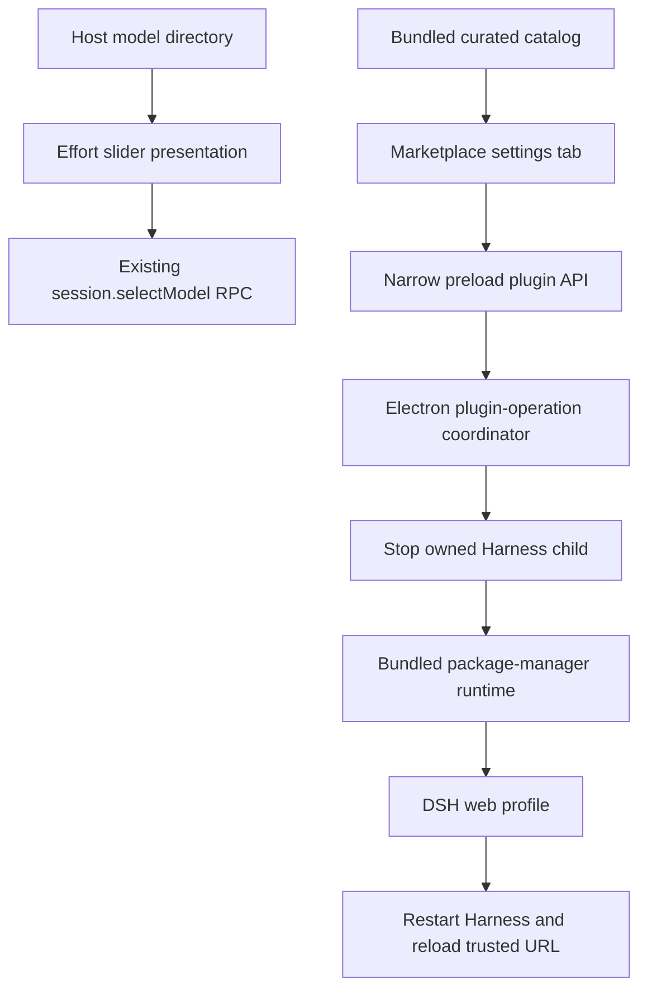

# DeepSeek Harness 思考滑块与插件市场设计

[English](2026-08-17-deepseek-harness-effort-slider-plugin-market-design.md) | 中文

**日期：** 2026-08-17

**状态：** 等待书面确认

**目标平台：** Intel macOS 和 Windows x64 上的 DeepSeek Harness Desktop

## 目标

DeepSeek Harness Desktop 将在输入框模型控件旁提供带粒子效果的精致思考等级滑块，并在设置中提供精选插件市场。滑块只能提交所选模型公开的思考等级标识。插件市场必须支持安装、停用、启用和移除经过审核的插件，用户无需安装 Node.js、pnpm，也无需打开终端或浏览器。

本设计结合 [dsh-effort-slider](https://github.com/2768651338/dsh-effort-slider) 的视觉方向和 [dsh-reasoning-effort](https://github.com/HanaAyane/dsh-reasoning-effort) 的模型元数据约束。它不会把两个插件同时加载到同一输入框位置，也不会复制任一插件在 Host 侧补写 Provider 配置的逻辑。

## 产品决定

- 思考滑块是内置 Web Client 插件，桌面应用更新后即可使用。
- Host 仍是 Provider、模型、思考等级标识、顺序、名称、描述和默认等级的唯一事实来源。
- `max` 可以显示为 `ULTRACODE`，但提交值仍是模型公开的精确标识。
- 只公开 `off`、`high` 和 `max` 的模型只显示三个可选档位，界面不会为它伪造 `low` 或 `medium`。
- 插件市场采用精选模式。GitHub Topics 和任意仓库 URL 只供维护者发现候选插件，不会成为应用可直接执行的安装来源。
- 市场修改操作只在桌面应用中提供。普通浏览器应用继续保留只读的已安装插件清单，但不获得包管理权限。
- 第一版只安装精确且经过审核的版本，并禁用生命周期脚本。需要安装脚本的插件在出现更窄且经过审核的机制前不允许上架。

## 架构

思考滑块的修改保留在现有 `ui-model-selection` 包中，因为该包拥有共享的会话级模型目录和输入框模型位置。独立的 `EffortSlider` 展示组件只接收当前模型的思考等级列表和选择回调；它不会直接访问 Cordis、Electron、Provider 配置或会话 RPC。

插件市场增加专用的 Web Client 设置插件和桌面主进程协调器。客户端贡献一个 `settings.plugins.tab` 页面，通过注册侧桥接取得普通的市场状态和操作回调。Electron preload 只公开带类型的市场操作。Electron 主进程会根据受信任主窗口、主 frame 和当前回环来源校验每个调用方，然后才接受操作。

## 思考滑块

### 数据与选择

当前模型的 `reasoning.efforts` 数组按顺序定义滑块档位。选中值来自当前会话思考等级或模型默认值。每次操作通过现有 `ModelDirectory.select()` 路径提交当前 Provider、模型和精确档位；Host 会在持久化前继续执行现有路由与思考等级校验。

可见名称默认使用适配器提供的名称，仅把 `max` 作为展示别名显示为 `ULTRACODE`。无障碍文本会同时保留两层含义，例如 `ULTRACODE，最高思考等级`。未知标识仍可选择并显示适配器给出的名称；客户端不会把它们强行归并到硬编码的五档词表。

### 交互与渲染

- 根模型菜单保留现有 Model 和 Effort 两行，打开 Effort 后在同一锚定下拉菜单中显示滑块面板。
- 指针拖动会预览最近档位，松开、点击、键盘方向键、Home 和 End 会提交一个已公开档位。
- 提交期间锁定新的提交并保留当前值；提交被拒绝时保留原档位，并复用现有输入框 Toast。
- WebGL 画布绘制克制的蓝紫色粒子流，粒子能量随所选档位变化；它不具备网络、存储、模型或包管理权限。
- WebGL 初始化失败时使用 CSS 渐变轨道；`prefers-reduced-motion: reduce` 保留静态轨道和滑块，但关闭持续动画。
- 控件沿用现有语义主题变量、键盘焦点样式、深浅主题、紧凑宽度和响应式溢出规则。

如果从 BSD-3-Clause 的 `dsh-effort-slider` 仓库改编 shader 或粒子代码，`THIRD_PARTY_NOTICES.md` 会记录精确复用范围、上游 revision、版权声明和许可证。Host 配置补写、Provider 方言映射和模型元数据注入明确排除。

## 插件市场

### 设置体验

现有插件设置包含三个标签页：

1. **插件市场**——可搜索的审核卡片，展示名称、简介、发布者、精确版本、许可证、兼容性、声明能力和安装状态。
2. **已安装**——把当前 Loader 清单与包管理状态合并，提供启用、停用、移除和需要重启的状态。
3. **配置**——保留现有 Host 插件配置卡片及其行为。

内置插件标记为“内置”，不能移除。第三方条目每次只显示一个主要操作。安装或移除期间显示全局操作状态，防止并发启动多个包写入。

### 市场清单

第一版在应用成品中内置一份市场清单快照。每个条目包含稳定市场 id、npm 包名、展示信息、精确版本、DSH 版本范围、支持的桌面平台、许可证标识、源码仓库、声明能力、包完整性和审核发布状态。

应用不会在运行时抓取 `github.com/topics/dsh-plugin`。增加或更新市场条目属于经过源码审查的桌面应用发布修改。这样第一版能够直接提供市场，同时让发布者信任、包版本和完整性与应用代码一起接受审查。脱离桌面版本的远程市场更新和任意来源开发者模式不属于第一版范围。

### 安装生命周期

桌面包内置 Profile 操作所需的包管理运行时。渲染进程只提交市场 id 和请求操作；它不能提交包 specifier、命令行参数、文件系统路径、Registry URL 或可执行文件名。

执行安装、更新、启用、停用或移除时，Electron 主进程按以下顺序工作：

1. 获取进程内操作锁，并从内置市场清单重新解析所选条目。
2. 把 Web Profile 控制文件复制到 Electron 应用数据目录中的本次操作专属备份，不复制凭据或会话数据。
3. 停止桌面应用精确持有的 Harness 子进程，并等待完整进程树退出。
4. 通过 Electron Node 模式调用内置包管理器，使用固定参数模板、精确包版本、固定 Web Profile 目录，并禁用生命周期脚本。
5. 协调 `dsh.profile.bundles`、校验生成的 manifest、解析每个启用 bundle，并运行有界的 `dsh --profile web --dump-config` 预检。
6. 成功后删除备份，在新的随机回环端口重启 Harness，并且只加载经过校验的 URL。
7. 失败时恢复 Profile 控制文件，必要时根据恢复后的 lockfile 执行恢复安装，重新启动原 Profile，并报告脱敏错误。

协调器绝不会在它持有的 Harness 子进程运行期间修改 `~/.dsh`。它不会检查、复制、记录或移除凭据、工作区、会话或 Electron 用户数据。回滚后残留但没有引用的包存储文件不具备执行条件，因为恢复后的 manifest 和 bundle 列表不会引用它们；后续维护可以显式清理这些文件。

## 桌面安全

- Preload 在上下文隔离下只公开结构化市场方法；不会公开 IPC 原语、Shell 执行、文件系统访问或任意 URL。
- Electron 主进程只接受受信任主 `webContents`、其主 frame 和精确当前 `http://127.0.0.1:<random-port>` 来源的请求。
- 市场清单和操作值会在 Electron 主进程中再次校验，绝不信任渲染进程提交的展示数据。
- 包安装使用精确版本、校验预期包完整性、禁用生命周期脚本，并拒绝安装 manifest 中没有 DSH bundle patch 的包。
- 输出在到达日志或界面前会限制字节数并脱敏；环境值、凭据、Profile 文档和包管理命令行不会进入用户可见错误。
- 符号链接和路径检查把备份、Profile 与包操作限制在各自精确解析根目录中；删除目标必须明确并经过校验。

## 失败处理

- 缺少桌面桥接时隐藏市场修改控件，同时保持已安装插件清单可读。
- WebGL 或动画失败只影响展示，不会禁用模型选择。
- 市场清单校验失败时禁用市场操作并指出无效条目，不会开始安装。
- 包管理失败、DSH 版本不兼容、bundle 解析失败、配置预检失败、Harness 重启失败或操作超时都会先进入回滚，再向界面报告失败。
- 如果请求后的 Profile 和恢复后的 Profile 都无法启动，现有桌面错误页会报告有界诊断，并保留备份与 Harness 数据供恢复。
- 操作期间关闭应用会请求取消，等待有界协调器结束，必要时再执行现有的强制进程树清理。

## 持久化与兼容性

思考等级继续通过现有会话模型选择事件和设置持久化，视觉组件不增加新的持久化格式。市场状态从 Web Profile manifest、bundle 列表、Loader 清单和内置市场清单推导，不维护第二份已安装插件数据库。

桌面包会升级版本，因为应用增加内置包管理依赖和新的原生生命周期行为。现有 `~/.dsh` Profile 保持有效。市场操作只通过 `dsh plugin` 使用的相同 manifest 格式修改所选 Profile 的依赖和 bundle 配置。

## 验证

- 组件测试覆盖公开档位渲染、`max` 展示、指针和键盘选择、提交被拒后的回滚、忙碌状态、减少动态效果和 WebGL 降级。
- 模型选择测试证明每个提交档位都属于所选模型公开数组，而且 DeepSeek 的三档目录永远不会产生 `low` 或 `medium`。
- 市场清单测试覆盖 schema 拒绝、重复 id、DSH 范围不兼容、不支持的平台、无效完整性、未审核条目和确定性的安装状态合并。
- Desktop 测试覆盖受信调用方校验、操作锁、固定包管理参数、有界输出、精确根目录、备份与恢复、生命周期脚本禁用、预检失败、重启结束条件和错误脱敏。
- 真实组合 Web 测试通过完整应用打开思考控件和市场标签页，不需要外部凭据。
- macOS 成品验收使用临时 `DSH_HOME` 安装和移除 fixture 插件，验证在新的随机端口重启、确认 fixture Loader 条目、操作滑块，并证明临时会话和凭据标记保持不变。
- 原生 Windows CI 对真实 Setup 成品执行相同的安装、重启、清单、移除、进程树、快捷方式、卸载和数据保留检查。

## 验收标准

- 输入框在现有模型控件区域显示精致的粒子思考滑块，不出现重复选择器。
- 只能提交模型精确公开的思考等级标识；官方 DeepSeek 公开 `off`、`high` 和 `max`。
- `max` 显示为 `ULTRACODE`，但线上请求值不变。
- 设置提供可搜索的插件市场、已安装和配置视图，并支持键盘和屏幕阅读器。
- 桌面用户可以通过按钮安装、启用、停用和移除审核插件，并自动重启 Harness，无需 Node.js、pnpm、终端、浏览器、管理员权限或固定端口。
- 操作失败会恢复之前可运行的 Profile，并保留 Harness 会话、工作区、凭据和 Electron 用户数据。
- 普通浏览器客户端不能请求包安装，也不能访问桌面桥接。
- 发布成品前必须通过 macOS Intel 和原生 Windows 成品验收。

## 未采用的方案

不同时安装两个第三方思考等级插件，因为它们会争用同一输入框控件，而且其中一个会修改 Provider 能力元数据。不允许从 GitHub Topic 任意安装仓库，因为 Topic 无法证明兼容性、作者身份、包不可变性或生命周期脚本安全性。不把所有候选插件预装进应用，因为这会扩大安装包，也无法实现独立安装和移除。

## 范围外事项

- 安装任意 GitHub URL、文件系统路径、git 分支或包 specifier。
- 未经审核就从 GitHub Topics 或 `awesome-dsh-plugin` 自动发现插件。
- 脱离桌面应用发布的远程市场更新。
- 需要生命周期脚本、原生编译、管理员权限或写入 DSH Web Profile 以外位置的插件。
- 自动发布、代码签名、公证或市场发布者账号。
