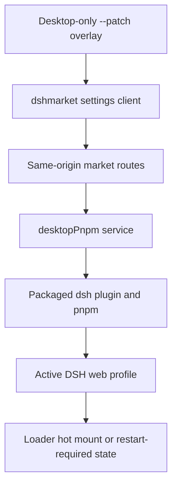

# DeepSeek Harness Plugin Marketplace Design

English | [中文](2026-08-17-deepseek-harness-plugin-market-design.zh.md)

**Date:** 2026-08-17

**Status:** Implemented

**Target:** DeepSeek Harness Desktop on Intel macOS and Windows x64

## Goal

DeepSeek Harness Desktop integrates the audited `dshmarket@1.10.1` marketplace under Settings. Users can search, install, update, enable, disable, and remove curated plugins without installing Node.js or pnpm, opening a terminal or external browser, granting administrator rights, or choosing a fixed port.

The Desktop composition reuses the mature [dsh-market](https://github.com/dsh-market/dsh-market) implementation instead of duplicating its catalog, rollback, diagnostics, and hot-mount logic. The composer model control remains the original simple Host-advertised effort list.

## Product Decisions

- Desktop pins and redistributes `dshmarket@1.10.1`; its curated registry and bundled snapshot supply the catalog.
- GitHub Topics are discovery inputs, not an installation API. Desktop exposes no free-form package, command, filesystem, registry, or executable field.
- Desktop supplies immutable profile identity and packaged package-manager access through `desktopProfiles` and `desktopPnpm`; the market never provisions system pnpm in Desktop mode.
- pnpm's deny-by-default build policy remains authoritative. A blocked build requires an explicit per-package approval and retry.
- The existing model and effort selectors remain independent of the market and continue to use Host metadata and validation.

## Architecture

The marketplace is mounted by a Desktop-only patch passed to the bundled CLI before Web arguments. The patch first mounts a small first-party Host adapter that publishes the active web profile and a generation-scoped package-operation service, then mounts pinned `dshmarket`. Ordinary Web launches do not receive the patch. Electron preload gains no marketplace, filesystem, shell, package, or raw IPC method.

## User Interface and Lifecycle

Pinned `dshmarket` contributes its searchable catalog, installed view, themes, progress, diagnostics, backup, and package actions to Settings. Existing first-party Configuration and read-only Plugin list tabs remain unchanged.

Market mutations require same-origin loopback requests. `dshmarket` validates catalog membership and command targets, holds one operation lock, snapshots manifest dependencies for failed-operation rollback, validates loadable DSH artifacts and duplicate Loader ids, and hot-mounts supported plugins. Its Desktop adapter calls `desktopPnpm.runPlugin()`, which invokes the packaged DSH CLI so upstream profile initialization, relative-source anchoring, and `dsh.profile.bundles` reconciliation remain authoritative.

`desktopPnpm` resolves the packaged pnpm entry itself, rejects empty or NUL-bearing arguments and non-absolute caller directories, scrubs credential-shaped environment variables, owns bounded output streams, serializes operations, and delegates cancellation and whole-tree teardown to the existing subprocess service. Detached self-restart is disabled in Desktop mode. Hot-mountable plugins activate immediately; other changes remain visibly restart-required until the application is relaunched normally.

## Security and Failure Handling

- The Desktop patch is an application resource, not a user-writable profile overlay.
- `desktopProfiles.current` is immutable for one Cordis generation. After Desktop is detected, the market never falls back to an ambient or guessed profile.
- Browser code cannot submit arbitrary package targets; market routes re-resolve curated entries before mutation.
- Trusted Host code resolves the packaged pnpm and CLI entries without renderer input.
- Package children receive a credential-scrubbed environment and only the explicit active `DSH_HOME` fact needed by the CLI.
- Packages without loadable DSH artifacts, or with Loader ids that collide with the active profile, are removed before they can break the next boot.
- A missing Desktop service leaves the market adapter pending instead of mutating through system pnpm.
- Package failure, timeout, cancellation, or partial manifest writes are reported through bounded results and rollback safeguards.
- Sessions, credentials, workspaces, and Electron user data are never copied, deleted, or included in package-operation output.

## Verification and Acceptance

- Adapter tests cover immutable profile identity, packaged pnpm resolution, argument and path rejection, single-operation locking, `dsh plugin` invocation, cancellation, whole-tree teardown, and credential scrubbing.
- Integration tests prove only Desktop mounts pinned `dshmarket`, ordinary Web omits it, and the market consumes Desktop services instead of system pnpm provisioning.
- A real Web composition opens Marketplace through the assembled application without external credentials.
- Staged and packaged checks verify the immutable patch, provider, market Host and Client artifacts, packaged pnpm entry, native modules, and third-party notices.

Acceptance requires a searchable market with install, update, enable, disable, and remove actions; no external runtime prerequisite; no new preload authority; preserved Harness data; and green Intel macOS plus native Windows packaged checks before public release.

## Alternatives and Scope

Rebuilding a second market was rejected after auditing `dshmarket@1.10.1`; duplication would increase risk and maintenance cost. Installing arbitrary GitHub repositories was rejected because a Topic does not establish compatibility, authorship, immutability, or safe lifecycle behavior.

Arbitrary package specifications, automatic installation from GitHub Topics, administrator-level plugins, writes outside the active web profile, code signing, notarization, and marketplace publisher accounts are out of scope.
